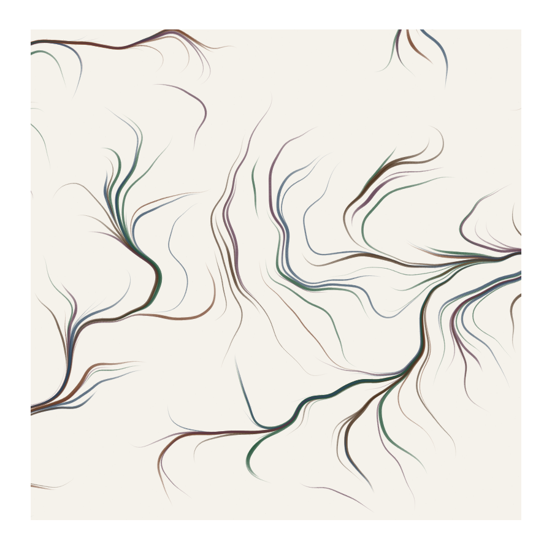

# Brush Flow Integration


## Preview


## What it looks like
Visible brush strokes that follow invisible currents across the canvas — like paint dragged through a flowing medium, or a calligrapher whose hand follows the wind. Each stroke curves and bends as it traverses the field, accumulating texture and varying in pressure. The overall composition has a strong sense of directed movement, but individual strokes show the material quality of real brush marks (width variation, opacity changes, particle scatter). It's the marriage of flow-field direction with physical brush rendering.

## How it works
Define a vector field (from noise, mathematical function, or image gradient). For each stroke, start at a seed point and integrate forward through the field step by step. At each step: (1) sample the field to get direction, (2) advance the brush position by a small step in that direction, (3) render the brush mark at the new position using the current brush type (solid, scattered, tapered). The brush properties change per-step — width responds to field magnitude (fast flow = narrow, slow flow = wide), opacity responds to curvature (sharp turns = lighter), and color can shift based on distance traveled. Deflection angle per step is clamped to prevent unrealistic sharp corners.

## Parameters
- **field function**: the vector field source — noise, curl, gradient, custom (various)
- **step size**: distance between brush stamps along the path (2-10 px)
- **max steps**: length of each stroke in integration steps (20-200)
- **deflection limit**: maximum turn angle per step in radians (0.05-0.5)
- **width mapping**: how field magnitude maps to stroke width (varies)
- **brush type**: rendering mode at each step — solid circle, scattered particles, or tapered segment

## Minimal p5.js sketch
```javascript
function setup() {
  createCanvas(400, 400);
  background(245, 242, 235);
  noLoop(); randomSeed(42); noiseSeed(42);
  noFill();

  let cols = [
    color(80, 50, 35),
    color(50, 70, 90),
    color(120, 70, 40),
    color(45, 80, 65)
  ];

  for (let s = 0; s < 80; s++) {
    let x = random(width), y = random(height);
    let col = random(cols);
    let maxW = random(2, 10);
    let steps = floor(random(40, 120));
    let prevAngle = 0;

    beginShape();
    for (let i = 0; i < steps; i++) {
      let t = i / steps;
      // Flow field from noise
      let angle = noise(x * 0.005, y * 0.005) * TWO_PI * 2;
      // Clamp deflection
      let diff = angle - prevAngle;
      diff = constrain(diff, -0.3, 0.3);
      angle = prevAngle + diff;
      prevAngle = angle;

      let pressure = exp(-pow((t - 0.35) / 0.3, 2));
      let w = lerp(0.5, maxW, pressure);
      let a = lerp(15, 120, pressure);

      stroke(red(col), green(col), blue(col), a);
      strokeWeight(w);

      let nx = x + cos(angle) * 3;
      let ny = y + sin(angle) * 3;
      line(x, y, nx, ny);
      x = nx; y = ny;

      // Stop if out of bounds
      if (x < 0 || x > width || y < 0 || y > height) break;
    }
  }
}
```

## Combinations

**Typical role:** structure / mark — provides both compositional flow direction and mark quality in one technique

**Works beautifully with:**
- **stochastic-brush-rendering**: Scattered particles along flow paths for charcoal-in-wind effect
- **pressure-simulation**: Pressure varies along the flow path for calligraphic flow strokes
- **domain-warping**: Warped noise field creates turbulent, swirling flow patterns
- **spectral-pigment-mixing**: Strokes that cross mix their colors physically at intersection points

**Creates tension with:**
- **grid-layout**: Flow is inherently continuous; grids impose discontinuity. Use flow within grid cells or let flow break the grid at specific points.

**Medium fit:** ink-on-paper, watercolor-wash, oil-impasto, charcoal-conte

**Explore from here:**
- If you like the directional quality → also look at flow-fields, spiral-flow-field
- If you want more physical brush quality → combine with fat-line-stroke for wide ribbon strokes along the flow
- To invent something new → try flow integration where the brush type changes based on field curvature — straight regions get smooth marks, turbulent regions get scattered particles

## Art Blocks examples
- Fidenza by Tyler Hobbs
- Meridian by Matt DesLauriers
- Flow by Misha de Ridder
