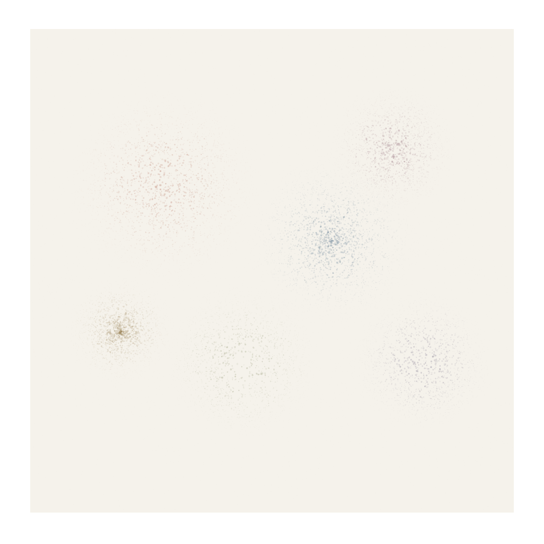

# Circular Spray Distribution


## Preview


## What it looks like
Dense, round clouds of tiny dots that fall off smoothly from a center point — like spray paint aimed straight at a wall from a fixed distance. The coverage is radially symmetric with a soft gradient from opaque core to sparse halo. Unlike random scatter, the distribution feels controlled and intentional, producing perfectly circular or slightly elliptical spray zones. Multiple spray passes overlap to create rich, velvety fields of color.

## How it works
For each spray center, generate particles using a radial distribution: angle is uniform random (0 to TWO_PI), and distance from center follows an inverse relationship with pressure — high pressure concentrates dots near center, low pressure spreads them wide. Specifically: `dist = radius * pow(random(), 1/pressure)` where pressure > 1 concentrates and pressure < 1 disperses. Each particle gets a random size and alpha that decreases with distance. The circular constraint means particles never appear in corners or along axes — the spray is always round.

## Parameters
- **spray radius**: maximum extent of the spray cloud (20-200 px)
- **pressure**: concentration exponent — higher = tighter core (0.3-3.0)
- **particle count**: dots per spray burst (200-5000)
- **dot size range**: min/max diameter of individual particles (0.5-4 px)
- **alpha falloff**: how quickly opacity drops with distance — linear, quadratic, or exponential

## Minimal p5.js sketch
```javascript
function setup() {
  createCanvas(400, 400);
  background(245, 242, 235);
  noLoop(); randomSeed(42); noiseSeed(42);
  noStroke();

  let sprays = [
    {x: 130, y: 150, col: color(140, 55, 30), r: 120, pressure: 1.8},
    {x: 280, y: 200, col: color(35, 70, 100), r: 100, pressure: 1.2},
    {x: 200, y: 320, col: color(80, 90, 40), r: 90, pressure: 2.2},
    {x: 320, y: 100, col: color(100, 50, 70), r: 70, pressure: 1.5},
  ];

  for (let sp of sprays) {
    for (let i = 0; i < 3000; i++) {
      let angle = random(TWO_PI);
      let dist = sp.r * pow(random(), 1.0 / sp.pressure);
      let px = sp.x + cos(angle) * dist;
      let py = sp.y + sin(angle) * dist;

      // Alpha decreases with distance
      let a = map(dist, 0, sp.r, 60, 3);
      a *= random(0.3, 1.0);

      let sz = map(dist, 0, sp.r, 2.5, 0.5) * random(0.5, 1.5);
      fill(red(sp.col), green(sp.col), blue(sp.col), a);
      ellipse(px, py, sz);
    }
  }

  // Fine overspray haze
  for (let i = 0; i < 2000; i++) {
    let sp = random(sprays);
    let angle = random(TWO_PI);
    let dist = sp.r * (1 + random() * 0.8);
    fill(red(sp.col), green(sp.col), blue(sp.col), random(2, 8));
    ellipse(sp.x + cos(angle) * dist, sp.y + sin(angle) * dist, random(0.3, 1.5));
  }
}
```

## Combinations

**Typical role:** texture / fill — creates soft radial color zones and spray-paint fields

**Works beautifully with:**
- **alpha-spatter**: Circular spray for controlled zones, alpha-spatter for chaotic gaps — together they produce full spray-paint realism
- **posterize-quantization**: Hard stencil masks with soft circular spray around them = street art / screen print
- **particle-systems**: Spray as emission pattern — particles born in circular distribution then evolve with physics
- **signed-distance-fields**: SDF masks control where spray lands — spray only inside or outside shapes

**Creates tension with:**
- **line-drawing**: Spray is diffuse and area-based; lines are precise and directional. Keep spray as background, lines as foreground.

**Medium fit:** spray-paint, ceramic-glaze, watercolor-wash

**Explore from here:**
- If you like the controlled distribution → also look at noise-density-scatter, particle-systems
- If you want anisotropic spray → combine with flow-fields to elongate the spray cloud along a direction
- To invent something new → try spray bursts where pressure oscillates with time, creating concentric density rings

## Art Blocks examples
- Rinascita by Stefano Contiero
- Elevated Deconstructions by luxpris
- Rapture by Thomas Lin Pedersen
