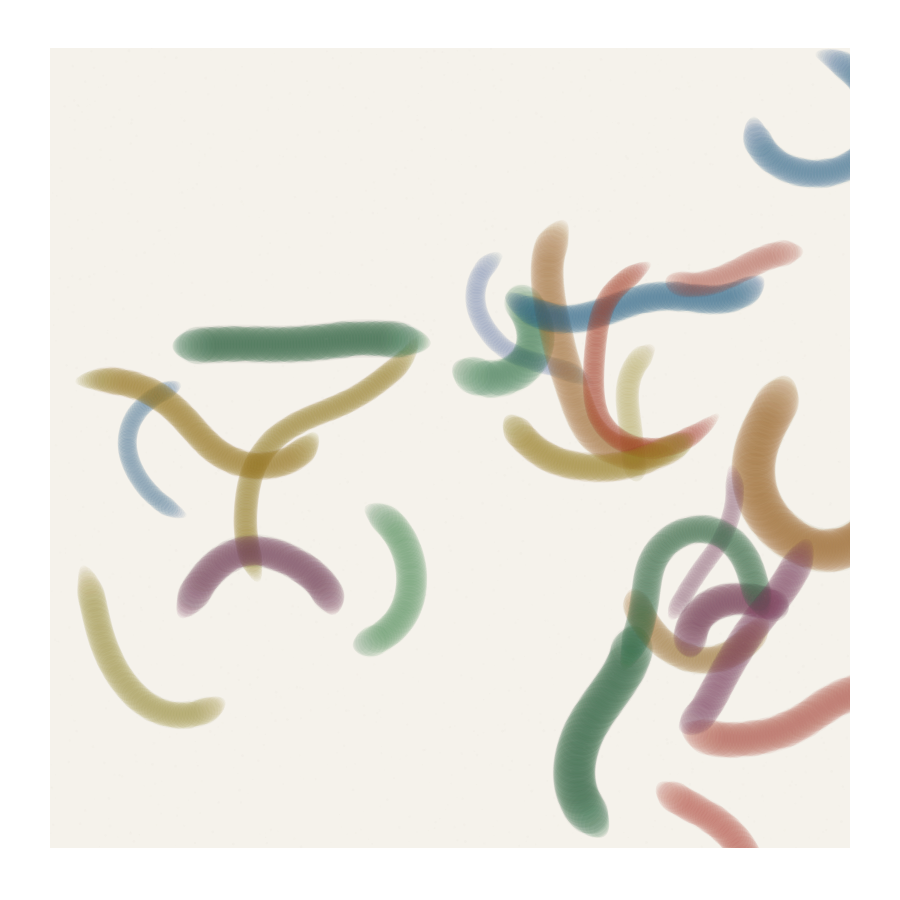

# Marker Blend Stroke


## Preview


## What it looks like
Bold, flat strokes with saturated color and characteristic marker behavior — semi-opaque coverage that darkens where strokes overlap, soft blending at the endpoints, and slight color accumulation along edges. The marks feel like alcohol markers or felt-tip pens on smooth paper. Where two strokes of different colors cross, the overlap zone shows a blended intermediate rather than hard layering. Endpoints have a rounded, slightly feathered quality.

## How it works
Each stroke is drawn as a series of closely-spaced overlapping circles (or short fat segments) along a path. The key behaviors: (1) Each stamp has medium opacity (0.1-0.3), so overlapping stamps within the same stroke build up to near-opaque; (2) At stroke endpoints, stamp spacing increases and radius decreases for a natural taper; (3) Where strokes cross, the new stroke's color mixes with the existing color using a weighted average (simulating dye penetration into paper). Color accumulation is tracked per-pixel — each new layer darkens slightly, mimicking how marker ink saturates the paper.

## Parameters
- **stroke width**: diameter of the marker tip (8-40 px)
- **stamp opacity**: alpha per stamp circle (0.08-0.25)
- **stamp spacing**: distance between centers as fraction of width (0.1-0.4)
- **blend strength**: how much crossing strokes mix vs layer (0-1)
- **endpoint taper**: length of the feathered tip at start/end (0.5-2× width)
- **saturation boost**: increase in saturation at overlap zones (0-0.3)

## Minimal p5.js sketch
```javascript
function setup() {
  createCanvas(400, 400);
  background(245, 242, 235);
  noLoop(); randomSeed(42); noiseSeed(42);
  noStroke();

  let markers = [
    color(180, 60, 50),   // warm red
    color(50, 100, 150),  // steel blue
    color(160, 140, 40),  // ochre
    color(60, 120, 80),   // forest green
  ];

  // Draw overlapping marker strokes
  for (let s = 0; s < 15; s++) {
    let col = random(markers);
    let w = random(12, 30);
    let x = random(40, 360), y = random(40, 360);
    let steps = floor(random(30, 80));
    let stampAlpha = random(15, 40);

    for (let i = 0; i < steps; i++) {
      let t = i / steps;
      // Taper at endpoints
      let taper = 1.0;
      if (t < 0.1) taper = t / 0.1;
      if (t > 0.85) taper = (1 - t) / 0.15;
      taper = sqrt(taper); // soften taper curve

      let cx = x + noise(s * 3, i * 0.03) * 250 - 125;
      let cy = y + noise(s * 3 + 50, i * 0.03) * 200 - 100;

      let r = w * taper;
      fill(red(col), green(col), blue(col), stampAlpha * taper);
      ellipse(cx, cy, r, r * random(0.85, 1.0));

      // Slight edge darkening
      fill(red(col) * 0.7, green(col) * 0.7, blue(col) * 0.7, stampAlpha * 0.2 * taper);
      ellipse(cx, cy, r * 1.05, r * 1.05);
    }
  }
}
```

## Combinations

**Typical role:** mark / color — creates bold graphic strokes with natural color interaction

**Works beautifully with:**
- **line-drawing**: Fine pen lines over marker fills — classic illustration technique
- **spectral-pigment-mixing**: Spectral mixing at overlap zones produces realistic marker color interaction
- **posterize-quantization**: Flat marker color + posterized tones = graphic novel / comic aesthetic
- **flow-fields**: Marker strokes that follow flow create directional color fields

**Creates tension with:**
- **alpha-spatter**: Markers are smooth and flat; spatter is noisy. Together they fight for surface quality. Use spatter only at edges.

**Medium fit:** ink-on-paper, gouache-layers, spray-paint

**Explore from here:**
- If you like the bold color → also look at fat-line-stroke, blend-modes
- If you want more realistic blending → combine with spectral-pigment-mixing for dye-accurate overlap
- To invent something new → try marker strokes where color shifts along the length, simulating a marker running dry

## Art Blocks examples
- Archetype by Kjetil Golid
- Geometry Runners by Rich Lord
- 923 Empty Rooms by Casey REAS
