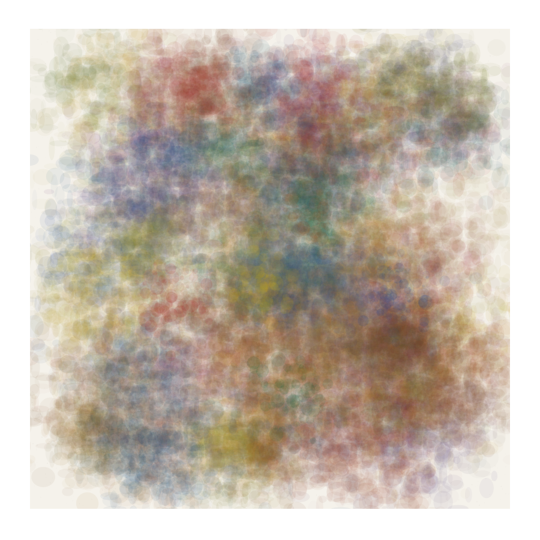

# Spectral Pigment Mixing


## Preview


## What it looks like
Color mixing that behaves like real paint on a palette — blue and yellow make a rich green (not the gray you get from naive RGB averaging), and layered washes darken naturally like watercolor. Overlapping colors produce the deep, saturated intermediates you see in physical painting rather than the washed-out or muddy results of digital blending. Particularly striking for glazing effects where translucent layers build up complex color.

## How it works
Convert RGB colors into a spectral representation (reflectance curves across wavelength bands, typically 38 bands from 380-720nm). Mix by weighting the reflectance curves using Kubelka-Munk theory, which models how pigment particles absorb and scatter light. The K/S ratio (absorption/scattering) is computed per wavelength, mixed linearly, then converted back to reflectance and finally to RGB. This produces subtractive mixing: overlapping pigments absorb more light, yielding darker, more saturated results — exactly like physical paint.

## Parameters
- **spectral bands**: number of wavelength samples (12-38, more = more accurate)
- **K/S ratio**: absorption-to-scattering ratio per pigment (controls opacity/transparency)
- **concentration**: amount of each pigment in the mix (0-1)
- **substrate reflectance**: the "paper" or "canvas" reflectance underneath (white = high, tinted = lower)
- **layer count**: number of overlapping paint layers for glazing effects (1-8)

## Minimal p5.js sketch
```javascript
// Simplified spectral mixing using sqrt blending (approximation)
function pigmentMix(c1, c2, t) {
  // Attempt subtractive-style mix via sqrt space
  let r = sqrt(lerp(sq(red(c1)/255), sq(red(c2)/255), t)) * 255;
  let g = sqrt(lerp(sq(green(c1)/255), sq(green(c2)/255), t)) * 255;
  let b = sqrt(lerp(sq(blue(c1)/255), sq(blue(c2)/255), t)) * 255;
  return color(r, g, b);
}

function setup() {
  createCanvas(400, 400);
  background(245, 242, 235);
  noLoop(); noStroke();

  let colors = [
    color(30, 80, 160),  // ultramarine
    color(200, 170, 20), // yellow ochre
    color(170, 40, 30),  // cadmium red
    color(25, 100, 60),  // viridian
  ];

  // Paint overlapping translucent circles with pigment mixing
  for (let i = 0; i < 60; i++) {
    let c1 = random(colors);
    let c2 = random(colors);
    let mixed = pigmentMix(c1, c2, random(0.3, 0.7));
    let x = random(60, 340), y = random(60, 340);
    fill(red(mixed), green(mixed), blue(mixed), random(30, 90));
    ellipse(x, y, random(60, 180), random(60, 180));
  }
}
```

## Combinations

**Typical role:** color — governs how overlapping colors interact throughout the piece

**Works beautifully with:**
- **blend-modes**: Replace standard blend with spectral mix for physically-correct transparency stacking
- **layered-composition**: Each layer's colors mix subtractively with layers below — true glazing
- **gradient-systems**: Spectral interpolation between palette colors avoids the gray dead zones of RGB lerp
- **flow-fields**: Flow lines with spectral color mixing at intersections produce rich, painterly overlap

**Creates tension with:**
- **posterize-quantization**: Spectral mixing produces continuous subtle variation; posterizing discards it. Choose one as dominant.

**Medium fit:** watercolor-wash, gouache-layers, oil-impasto, ceramic-glaze

**Explore from here:**
- If you like the color depth → also look at cosine-gradient-palette, hsb-hsl-color
- If you want glazing specifically → combine with alpha-spatter for granulation in the wash
- To invent something new → try spectral mixing where each pigment has a different scattering coefficient, simulating opaque vs transparent paint in the same stroke

## Art Blocks examples
- 100 Untitled Spaces by Snowfro
- Chromie Squiggle by Snowfro (color interpolation)
- Gazers by Matt Kane
