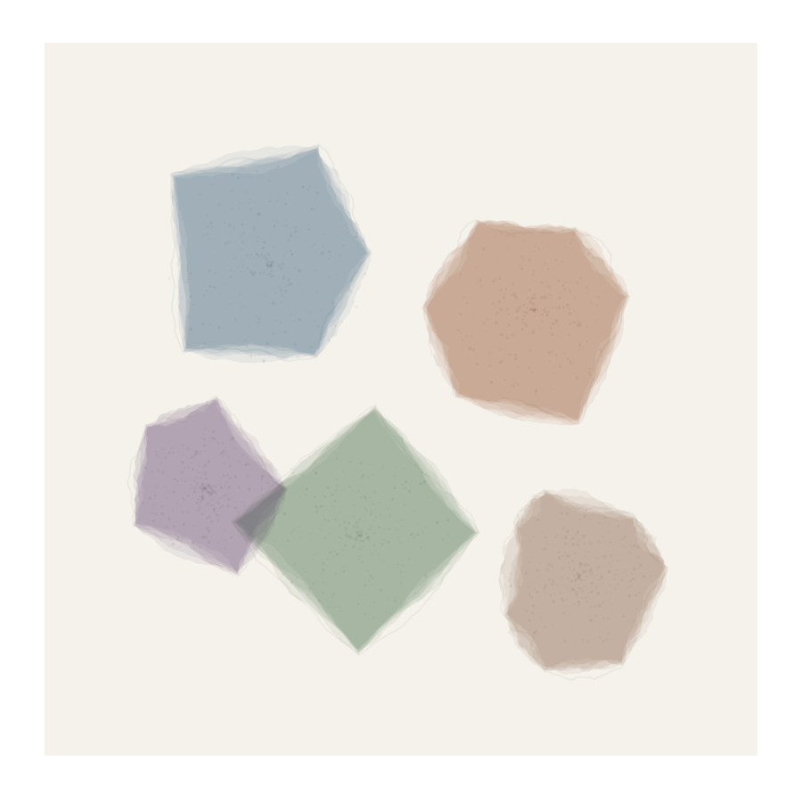

# Watercolor Polygon Fill


## Preview


## What it looks like
Soft-edged, irregular shapes that look like watercolor washes pooled within a boundary. Edges are wobbly and organic — never perfectly straight — with pigment concentrating along the borders and thinning in the center, just like real watercolor drying on paper. Multiple transparent layers overlap to build up color depth, and each layer is slightly different, creating the luminous, breathing quality of real watercolor.

## How it works
Start with a polygon (any shape). Recursively displace each edge midpoint outward or inward by a random amount, subdividing edges into increasingly irregular contours. Do this 4-8 times to get a wobbly organic boundary. Then render the shape multiple times (3-6 layers) with low opacity, each time re-displacing the edges slightly differently. The accumulation of slightly-different transparent layers creates edge darkening (pigment pooling) and interior luminosity. Each layer can also be slightly shrunk or expanded from the centroid.

## Parameters
- **subdivision depth**: number of recursive edge displacement passes (3-8)
- **displacement amount**: how far midpoints move perpendicular to edge (5-25 px)
- **layer count**: number of overlapping transparent renders (3-8)
- **layer opacity**: alpha per layer (0.03-0.12)
- **edge concentration**: how much extra pigment gathers at borders (0-1)
- **shrink per layer**: each layer contracts slightly toward center (0-5 px)

## Minimal p5.js sketch
```javascript
function setup() {
  createCanvas(400, 400);
  background(245, 242, 235);
  noLoop(); randomSeed(42); noiseSeed(42);

  // Draw several watercolor polygon fills
  for (let s = 0; s < 5; s++) {
    let cx = random(80, 320), cy = random(80, 320);
    let r = random(50, 100);
    let sides = floor(random(4, 8));
    let col = color(random([40,80,120,60]), random([50,70,90,100]), random([60,80,30,110]));

    // Base polygon
    let pts = [];
    for (let i = 0; i < sides; i++) {
      let a = TWO_PI * i / sides + random(-0.3, 0.3);
      pts.push({x: cx + cos(a) * r * random(0.7, 1.3), y: cy + sin(a) * r * random(0.7, 1.3)});
    }

    // Multiple layers with displaced edges
    for (let layer = 0; layer < 6; layer++) {
      let displaced = subdivideDisplace(pts, 4, 8);
      fill(red(col), green(col), blue(col), 15);
      noStroke();
      beginShape();
      for (let p of displaced) vertex(p.x, p.y);
      endShape(CLOSE);
    }
  }
}

function subdivideDisplace(pts, depth, amt) {
  let result = [...pts];
  for (let d = 0; d < depth; d++) {
    let next = [];
    for (let i = 0; i < result.length; i++) {
      let a = result[i];
      let b = result[(i + 1) % result.length];
      let mx = (a.x + b.x) / 2 + random(-amt, amt);
      let my = (a.y + b.y) / 2 + random(-amt, amt);
      next.push(a, {x: mx, y: my});
    }
    result = next;
    amt *= 0.55;
  }
  return result;
}
```

## Combinations

**Typical role:** structure / fill — creates the body of watercolor-style shapes

**Works beautifully with:**
- **flow-fields**: Polygon edges displaced along flow direction simulate directional wash bleeding
- **erode-dilate**: Dilation after polygon rendering adds ink-bleed softness at edges
- **alpha-spatter**: Scatter granulation dots within the polygon for pigment settling texture
- **gradient-systems**: Color varies across the polygon interior for non-uniform wash

**Creates tension with:**
- **grid-layout**: Watercolor fill is organic; grids are rigid. Use grid as underlying structure with watercolor filling each cell.

**Medium fit:** watercolor-wash, ink-on-paper, gouache-layers

**Explore from here:**
- If you like the soft edges → also look at deckled-edge, erode-dilate
- If you want more control over flow → combine with domain-warping to control where pigment pools
- To invent something new → try watercolor polygons where each layer uses a slightly different hue, simulating how real watercolor pigments separate as they dry

## Art Blocks examples
- Watercolor Dreams by numbersinmotion
- Paper Armada by Kjetil Golid
- Subscapes by Matt DesLauriers
