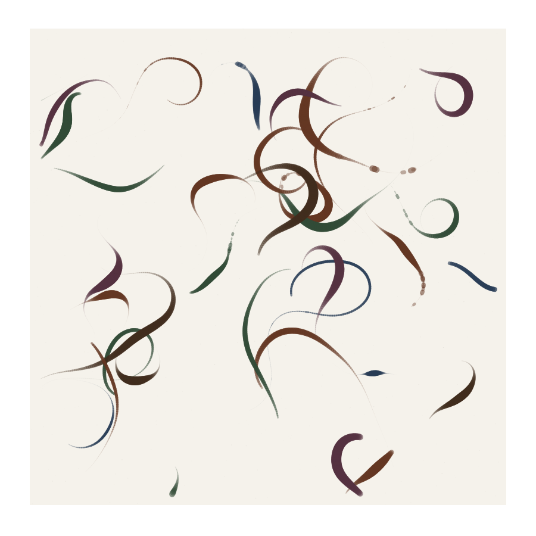
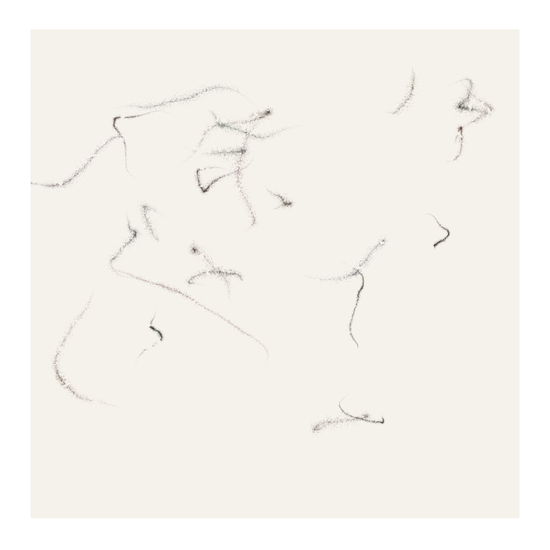
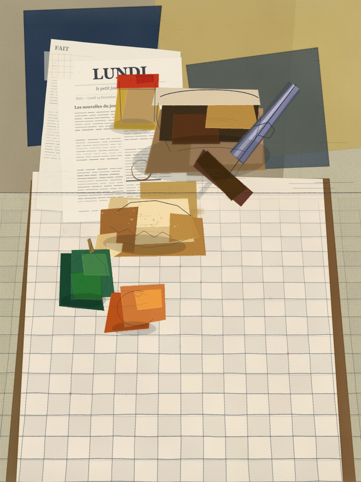

# The Artist

**An open-source environment that teaches AI agents to be artists — not image generators.**

Most AI "art" tools treat creation as a one-shot operation: describe what you want, press a button, get an image. The result has no history, no process, no physical truth. It wasn't *made* — it was *generated*.

**The Artist** is different. It gives an AI agent everything it needs to work through a genuine creative process — from studying the masters and choosing a medium, to prototyping individual techniques in isolation, to building a layered composition where materials interact like they would on a real canvas. The agent doesn't just output pixels. It develops a vision, makes artistic decisions, and iterates on its craft until every mark on the canvas is intentional.

The ultimate test: **could someone believe this is a photograph of a real artwork?** Not a digital illustration. Not a procedural pattern. A real thing — made with oil paint, torn paper, charcoal, ink, or whatever medium the vision demands.

---

## Why This Exists

There is a gap between what AI can generate and what an artist creates. An artist doesn't start with the final image. They start with influences, tensions, a feeling they can't quite name yet. They study other artists. They choose materials deliberately — oil on linen because the paint needs body, or torn paper on cardboard because the subject demands fragmentation. They build the work in layers, each one responding to what came before. They step back, squint, compare to the vision in their head, and go back in.

This project encodes that entire process as a structured environment for AI agents. It is built for [Claude Code](https://claude.ai/claude-code) using the [Claude Skills](https://docs.anthropic.com/en/docs/claude-code) framework, but the methodology and knowledge base are open and adaptable.

---

## What's Inside

### The Pipeline (`CLAUDE.md`)

A five-phase methodology that mirrors how a real artist works:

```
Phase 1: Vision Spec          — Conceive the artwork as a master painter would
Phase 2: Technique Palette     — Select algorithmic building blocks mapped to real materials
Phase 3: Notebook Prototyping  — Calibrate each technique in isolation (mandatory, never skip)
Phase 4: Composition           — Layer techniques with physical material interaction
Phase 5: Iteration             — Render, screenshot, verify against the vision, fix, repeat
```

Each phase has specific inputs, outputs, and acceptance criteria. The vision spec written in Phase 1 serves as the contract — the artwork isn't done until every element described in the spec is visually present and convincing in the rendered canvas.

### The Skills

Two Claude agent skills power the creative process:

**`art-masterpiece-designer`** — Guides the agent through artistic conception. The agent reflects on art movements, studies master artworks (downloading reference images), chooses a medium, resolves creative tensions, and produces a detailed vision spec. This isn't a prompt template — it's a structured creative journey that produces unique results every time.

**`technique-guide`** — A comprehensive reference system for mapping artistic intent to algorithmic techniques. The agent thinks in terms of physical mediums and visual feelings, not abstract algorithms.

### The Knowledge Base

| Resource | What it contains |
|----------|-----------------|
| **70 technique files** | From flow fields and spectral pigment mixing to stochastic brush rendering and watercolor polygon fills. Each includes visual description, algorithm, parameters, p5.js sketch, and combination advice. |
| **10 artistic mediums** | Fine pencil, gouache, watercolor wash, spray paint, ink on paper, woven textile, etching, ceramic glaze, charcoal/conte, oil impasto — each with core techniques, interaction rules, and surface pairings. |
| **10 visual intents** | "Something organic and alive," "quiet, meditative, minimal," "raw, physical, handmade" — maps artistic feelings to technique combinations. |
| **11 paper/surface types** | Hot-press watercolor, cold-press, rough, bristol, kraft, toned gray, linen canvas, cotton canvas, rice/washi, newsprint, yupo synthetic — each changes how techniques behave. |
| **Framing modes** | Full-bleed, bordered, deckled, vignette — presentation affects perception. |

### Technique Previews

The repository includes rendered previews of key techniques:

<p align="center">
  
  
  
  
</p>

<p align="center">
  <em>Pressure simulation · Watercolor polygon fill · Stochastic brush rendering · Spectral pigment mixing</em>
</p>

---

## How It Works in Practice

You tell the agent what you want — a feeling, a theme, a reference, or even just "surprise me." Then:

1. The agent studies art history, downloads reference images of inspiring masterworks, and writes a vision spec describing the artwork in the language a studio painter would understand — pigment names, brush behaviors, surface textures, spatial relationships.

2. It selects 3-8 techniques from the knowledge base, cross-referencing medium and intent to find the right algorithmic building blocks. An oil painting gets completely different code than a paper collage or a screen print.

3. It builds isolated notebook prototypes (standalone HTML/p5.js sketches) for each technique, iterating until each one looks physically convincing at the target canvas size with the chosen colors.

4. It composes the final artwork using layer-based material interaction — each technique reads the current surface state before applying its effect, just as real paint responds to what's already on the canvas. No zone-gating, no artificial boundaries. The regions in the final artwork emerge from material accumulation.

5. It renders, screenshots the result, walks through every element in the vision spec, identifies the worst discrepancy, fixes it, and renders again. This loop continues until the spec is satisfied.

The output is a self-contained HTML file using p5.js that renders the artwork in the browser — scalable from draft resolution to high-res print quality.

---

## Output Examples

Artworks created entirely by an AI agent using this environment — no image generation models, no diffusion, no GANs. Pure algorithmic painting through the five-phase pipeline.

<p align="center">
  
</p>
<p align="center">
  <strong>The Blue Train</strong> — Abstract Expressionism<br/>
  <em>Deep Prussian blue field with luminous signal points and sweeping calligraphic gestures. Oil glazes built in transparent layers over a dark ground, with linen weave visible through thin passages.</em>
</p>

<br/>

<p align="center">
  
  &nbsp;&nbsp;&nbsp;&nbsp;
  
</p>
<p align="center">
  <strong>Threshold of the Vast</strong> — Lyrical Abstraction
  &nbsp;&nbsp;&nbsp;&nbsp;&nbsp;&nbsp;&nbsp;&nbsp;&nbsp;&nbsp;&nbsp;&nbsp;&nbsp;&nbsp;&nbsp;&nbsp;&nbsp;&nbsp;&nbsp;&nbsp;&nbsp;&nbsp;&nbsp;&nbsp;&nbsp;&nbsp;
  <strong>Leila</strong> — Abstract
</p>

<br/>

<p align="center">
  
  &nbsp;&nbsp;&nbsp;&nbsp;
  
</p>
<p align="center">
  <strong>After Everyone</strong> — Brutalism
  &nbsp;&nbsp;&nbsp;&nbsp;&nbsp;&nbsp;&nbsp;&nbsp;&nbsp;&nbsp;&nbsp;&nbsp;&nbsp;&nbsp;&nbsp;&nbsp;&nbsp;&nbsp;&nbsp;&nbsp;&nbsp;&nbsp;&nbsp;&nbsp;&nbsp;&nbsp;&nbsp;&nbsp;
  <strong>Monday Breakfast</strong> — Cubism
</p>

---

## The Philosophy

### Physicality over aesthetics

Every technique simulates real material behavior. Oil paint mixes subtractively. Charcoal catches on paper tooth. Watercolor bleeds at wet edges. Torn paper has irregular fibers. The goal isn't "looks nice" — it's "looks *real*."

### Process over output

The five-phase pipeline exists because shortcuts produce bad art. Skipping notebooks means uncalibrated parameters. Skipping the vision spec means no acceptance criteria. Skipping iteration means the first render (which is never right) becomes the final output.

### Uniqueness over templates

Every artwork must be genuinely different. The pipeline gives you a *process*, not a *style*. An oil painting demands different code architecture than a Cubist collage, a Japanese woodblock print, or a mixed-media assemblage. If the agent catches itself reusing techniques, palettes, or layer structures from a previous artwork, it stops and starts fresh from the spec.

### Vision over generation

The agent doesn't produce what's statistically likely. It develops an artistic vision — with roots in art history, tension between influences, and a rationale for every major decision — and then executes that vision with craft. The vision spec is the contract, and the spec is written in the language of art, not engineering.

---

## Getting Started

### Prerequisites

- [Claude Code](https://docs.anthropic.com/en/docs/claude-code) CLI installed
- A modern browser (for rendering p5.js canvases)

### Setup

```bash
git clone https://github.com/your-username/the-artist.git
cd the-artist
```

The entire environment is defined in the `.claude/` directory and `CLAUDE.md`. No dependencies to install — the knowledge base is plain text (Markdown and YAML), and the artworks are self-contained HTML files.

### Creating Your First Artwork

Open Claude Code in the project directory and start a conversation:

```
"Create an artwork inspired by Japanese woodblock prints —
the tension between flat color planes and organic natural forms."
```

or simply:

```
"Make me a painting."
```

The agent will walk through all five phases, asking for your input at key moments and showing you renders for feedback along the way.

---

## Project Structure

```
the-artist/
├── CLAUDE.md                              # The five-phase pipeline methodology
├── README.md
└── .claude/
    └── skills/
        ├── art-masterpiece-designer/      # Skill: artistic vision & conception
        │   └── SKILL.md
        └── technique-guide/               # Skill: technique selection & combination
            ├── SKILL.md
            ├── mediums.yaml               # 10 artistic mediums
            ├── visual-intents.yaml        # 10 visual feeling mappings
            ├── papers.yaml                # 11 support surfaces
            ├── framing.yaml               # Presentation modes
            ├── previews/                  # Rendered technique samples
            ├── techniques/                # 70 algorithmic technique references
            │   ├── flow-fields.md
            │   ├── spectral-pigment-mixing.md
            │   ├── stochastic-brush-rendering.md
            │   ├── watercolor-polygon-fill.md
            │   └── ... (70 files)
            └── examples/
                └── combination-walkthrough.md
```

When the agent creates an artwork, it produces a project folder alongside this structure:

```
Artwork-Name/
├── artwork_name_vision_spec.md    # The artistic contract
├── references/                     # Downloaded masterwork images
├── notebooks/                      # Isolated technique prototypes
├── canvas/                         # Composition iterations (v1, v2, v3...)
└── assets/                         # Source material (if needed)
```

---

## Contributing

This is an open-source project and contributions are welcome. Areas where help is most valuable:

- **New techniques** — Add `.md` files to `techniques/` following the existing format. Each technique needs a visual description, algorithm explanation, parameters, minimal p5.js sketch, and combination advice.
- **New mediums** — Extend `mediums.yaml` with additional artistic mediums (fresco, encaustic, lithography, screen print, monotype...) and their technique mappings.
- **New papers/surfaces** — Add support surfaces to `papers.yaml` with their effect on technique behavior.
- **Artwork examples** — Share artworks created with this system. The more diverse the media and styles, the better the project demonstrates its range.
- **Pipeline improvements** — The five-phase methodology in `CLAUDE.md` is a living document. If you find better approaches to composition, iteration, or material interaction, open a PR.

---

## License

MIT

---

<p align="center">
  <em>Art is not what you see, but what you make others see.</em> — Edgar Degas
</p>
